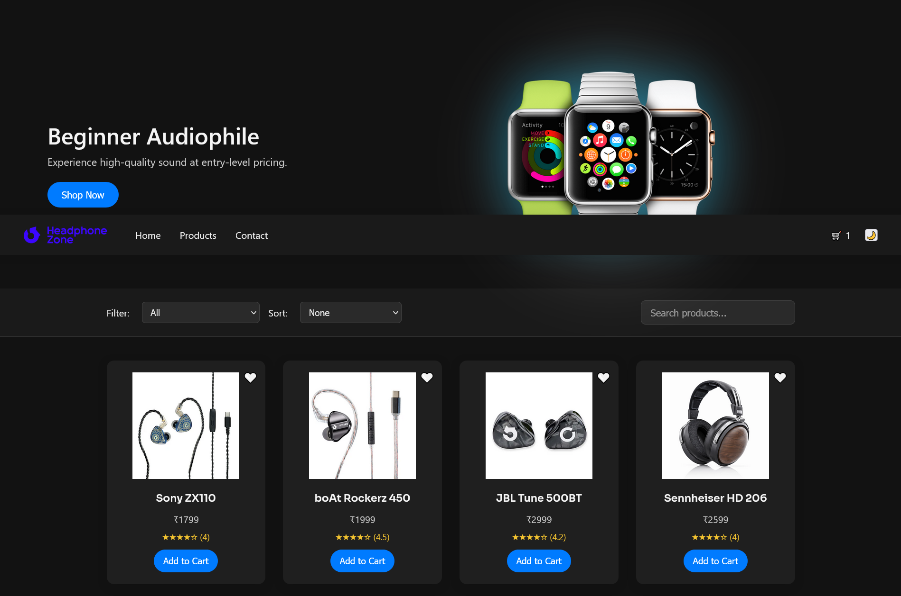

<h1 align="center">🎧 Audiophile Landing Page</h1>

  A modern, responsive landing page for an audio gear store.  
  Built with clean HTML, CSS, and JavaScript - designed with precision and passion.   
  

---

## 🌑 Overview

> A sleek landing page made for **audiophiles**, featuring a dark aesthetic, responsive layout, and smooth UI interactions. Tailored for those who love minimalism and clarity.

---

## ⚙️ Tech Stack

- ⚡ HTML5
- 🎨 CSS3 (Flexbox & Grid)
- ✨ JavaScript (Vanilla)
- 🌓 Mobile-first responsive design
- 📷 Custom assets and fonts

---

## 🧩 Features

- 🔗 Navigation bar with active links
- 📱 Responsive across all devices
- 🎯 Product highlight sections with CTAs
- 🗂️ Modular, readable code structure
- 🔻 Footer with links and contact info

---
